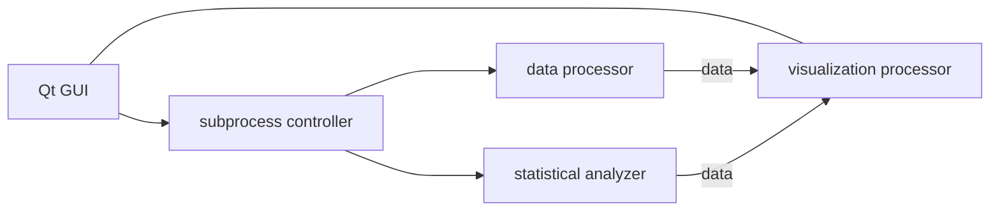

# Stock_Forecasting

high-level原理大概是这样的：

（预测就直接线性回归了，如果你想还可以训练一个小模型之类的，封装性还蛮高的）

以此为纲，在某神秘计金大佬和贵系大佬的帮助下，我大概想出了以下方案，你可以选一个或者全部打回。
* [自由！自由！自由！（方案一）]()
  * 使用`Python`的`subprocess`库进行程序控制，`pandas`库进行数据处理，用`PyQt5`进行GUI设计，最后用`matplotlib`进行数据可视化。同时使用`R`语言进行统计分析。
  * 正经`Quants`谁用c啊😋（滑稽）
  * 优点是由于这些我还算熟悉所以开发还蛮快的。
* [`c`是神圣不可侵犯的`C`!（方案二）]()
  * 使用`C++`进行程序控制，`Eigen`库进行数据处理，用`cppQt`进行GUI设计，最后用`matplotlib`进行数据可视化。同时使用`R`语言进行统计分析。
  * 优点是···但是（对于我）学习成本较高，开发速度可能会慢一点。
* [勇夺冠军！（方案三）]()
  * 使用“chrome-前端-后端”模式，使用前端三件套`HTML`、`CSS`、`JavaScript`进行GUI与程序控制，使用后端`Rust`进行数据处理、统计分析等过程，服务器使得一个`MLP`小模型成为可能，最后以chrome的html形式现实出来。
  * 少年，你想要租一个服务器吗？（滑稽）

如有问题：mails：[jianming23@stu.pku.edu.cn]()
